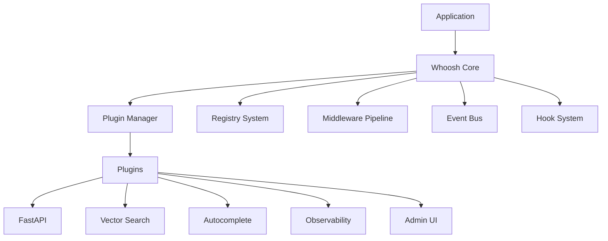

# Core Concepts

Whoosh-NG is a pure-Python search engine library. This guide explains the main concepts you need to understand to use it effectively.

## Architecture

Whoosh-NG follows a layered architecture:



## Key Components

### Index

An `Index` is the top-level container for your searchable documents. It manages one or more segments on disk.

```python
from whoosh.index import create_in, open_dir

# Create a new index
ix = create_in("indexdir", schema)

# Open an existing index
ix = open_dir("indexdir")
```

### Schema

The `Schema` defines the fields that documents in your index can have. Each field has a type that determines how it is indexed and stored.

```python
from whoosh.fields import Schema, TEXT, ID, NUMERIC

schema = Schema(
    title=TEXT(stored=True),
    path=ID(stored=True, unique=True),
    content=TEXT,
    rating=NUMERIC(float, stored=True)
)
```

### Writer

An `IndexWriter` lets you add, update, and delete documents in the index.

```python
writer = ix.writer()
writer.add_document(title="Hello", content="World")
writer.commit()
```

### Searcher

A `Searcher` lets you query the index and retrieve results.

```python
with ix.searcher() as s:
    results = s.search("hello")
```

### Query Parser

The `QueryParser` converts a query string into a query object that the searcher can execute.

```python
from whoosh.qparser import QueryParser

qp = QueryParser("content", schema)
query = qp.parse("hello world")
```

## Modern Features

### Plugin System

Plugins extend Whoosh-NG without modifying the core. Plugins can:

- Register new vector providers
- Add FastAPI endpoints
- Provide custom analyzers
- Hook into the middleware pipeline

```python
from whoosh.plugins.manager import PluginManager

# Load plugins from entry points
PluginManager.load_plugins()

# Or register manually
PluginManager.register("my_plugin", MyPlugin())
```

### Middleware Pipeline

Middleware intercepts indexing and search operations:

```python
from whoosh.middleware import Middleware, MiddlewareContext

class LoggingMiddleware(Middleware):
    def before_search(self, context: MiddlewareContext):
        print(f"Searching: {context.query}")
        return context

    def after_search(self, context: MiddlewareContext):
        print(f"Found: {len(context.results) if context.results else 0} results")
        return context
```

### Vector Search

Vector fields enable semantic search using embeddings:

```python
from whoosh.fields import Schema, TEXT, VectorField

schema = Schema(
    content=TEXT,
    embedding=VectorField(dimensions=384)
)
```

### Event Bus

The event system allows loose coupling between components:

```python
from whoosh.event_bus import EventBus, DocumentIndexed

bus = EventBus()

@bus.subscribe
def on_document_indexed(event: DocumentIndexed):
    print(f"Document indexed: {event.docnum}")
```

## Data Flow

### Indexing Flow

1. Application calls `writer.add_document()`
2. Schema validates and analyzes fields
3. Middleware `before_index` hooks run
4. Document is written to segment
5. Middleware `after_index` hooks run
6. `DocumentIndexed` event is published
7. `commit()` merges segments and writes TOC

### Search Flow

1. Application calls `searcher.search(query)`
2. Query is parsed into query tree
3. Middleware `before_search` hooks run
4. Searcher executes query against segments
5. Results are scored and sorted
6. Middleware `after_search` hooks run
7. `SearchExecuted` event is published
8. Results are returned to application

## Design Principles

1. **Composability**: Components combine via `|` and `+` operators
2. **Zero-cost abstractions**: No middleware = no overhead
3. **Sync-first**: Core is synchronous; async is opt-in
4. **Plugin isolation**: Plugins cannot break the core
5. **Type safety**: Comprehensive type hints throughout
